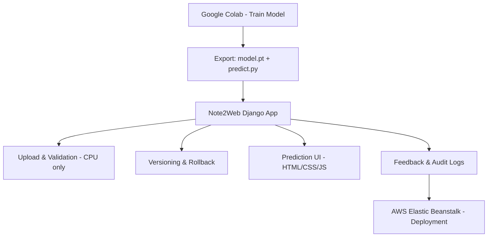
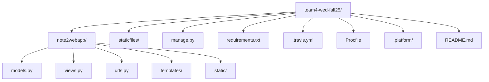

# Note2Web  
[](https://app.travis-ci.com/gcivil-nyu-org/team4-wed-fall25)

---

### 🧠 Overview
**Note2Web** converts Colab-trained PyTorch models into reproducible, web-accessible services — without re-running notebooks or managing complex environments.  
Upload your `model.pt` and `predict.py`, validate them once on CPU, and instantly serve predictions through a lightweight Django web app with version control, rollback, and feedback.

---

### ✨ Key Features
| Area | Description |
|------|--------------|
| **Model Upload & Validation** | Upload `model.pt` and `predict.py`. The app performs a one-time CPU-only validation with a dummy input, ensuring compatibility before activation. |
| **Versioning & Rollback** | Every successful upload becomes a version with metadata, timestamps, and rollback capability. |
| **Prediction via Web Form** | Simple UI for users to submit text/files and view model predictions and latency metrics. |
| **Feedback & Comments** | Model users can leave contextual comments tied to specific prediction runs or versions. |
| **Authentication & Roles** | Secure login system with three roles — Model Uploader, Model User, and Admin — each with distinct permissions. |
| **Admin & Audit Trail** | Administrative dashboards for managing users, viewing validation logs, and monitoring version activations or failures. |

---

### 👥 User Personas
- **Model Uploader** – Trains models in Colab, exports (`model.pt`, `predict.py`, optional `.ipynb`), uploads to Note2Web, validates, and manages versions.  
- **Model User** – Non-technical user who interacts with the active model through a web form and leaves feedback.  
- **Administrator** – Oversees platform health, manages roles, and ensures validation safety and reproducibility.

---

### 🏗️ Architecture (Mermaid Diagram)



---

### ⚙️ Tech Stack
| Category | Technologies |
|-----------|--------------|
| **Backend** | Python 3.11, Django |
| **ML Framework** | PyTorch |
| **Frontend** | HTML, CSS, JavaScript |
| **Database** | PostgreSQL (production) / SQLite (local) |
| **CI/CD** | Travis CI, Coverage, Flake8, Black |
| **Hosting** | AWS Elastic Beanstalk |
| **Other Tools** | Coveralls, GitHub Actions (planned) |

---

### 🧩 Folder Structure


---

### 🚀 Local Setup
1. **Clone repository**
   ```bash
   git clone https://github.com/gcivil-nyu-org/team4-wed-fall25.git
   cd team4-wed-fall25
   
2. **Create virtual environment**
   python3 -m venv venv
   source venv/bin/activate

3. **Install dependencies**
   pip install -r requirements.txt

4. **Run migrations**
   python manage.py migrate
   
5. **Start local server**
   python manage.py runserver

### ☁️ Deployment (AWS Elastic Beanstalk)

Travis CI automates validation, linting, and deployment:

Branches

develop → Staging (note2web-staging-clean)

main → Production (note2web-prod)

Build Steps

Run black, flake8, and coverage

On success, auto-deploy to Elastic Beanstalk

.travis.yml includes CPU validation, test coverage, and deployment configuration.


### 🔬 Testing
# Run all tests with coverage
coverage run manage.py test
coverage report

Style checks via black --check and flake8
CI status visible on Travis badge (top of README)


### 🤝 Contributing

Contributions are welcome!
Please open an issue or submit a pull request following the existing code style (black, flake8).
Ensure your changes pass all tests before submission.


### 📂 Repository Info

Primary Branches: develop, main

CI/CD: Travis → AWS Elastic Beanstalk

Active Environment: CPU-only

Artifact Policy: model.pt + predict.py required; optional .ipynb stored as documentation (never executed).
